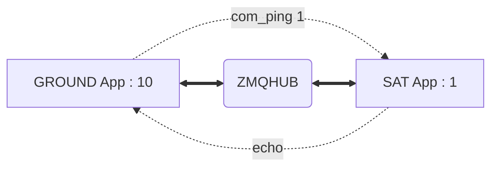

# SUCHAI Flight and Ground Software

This repository contains the source code of the SUCHAI-2, SUCHAI-3 and PlantSat satellites onboard software (aka
flight sogtware), and the ground segment software. Both software are based on the 
[SUCHAI Flight Software](https://gitlab.com/spel-uchile/suchai-flight-software) framework, so please refer to its 
documentation for further details.

**NOTE:**
> This branch (framework-sim) contains a simplified version of the satellites' onboard software
> that does not require hardware specific dependencies and thus, does not implement (or simply simulates)
> hardware related commands. Therefore, this branch is for testing purposes only.

## Repository initialization

This repository has the following dependencies:

- SUCHAI Flight Software: https://gitlab.com/spel-uchile/suchai-flight-software

So please run the following to clone/download these dependencies (we decided not using git submodules):

```shell
sh init.sh
```

### Repository structure

The repository simplified structure is as follows:

```shell
suchai-2-software
├── apps
│   ├── groundstation       # Ground station application
│   ├── plantsat            # SUCHAI-2, SUCHAI-3, and PlantSat flight software application
│   └── simple              # Example application (not relevant)
└── suchai-flight-software  # SUCHAI Flight Software repository (external repository)
```

## Build and run

### Dependencies

Please check and install the [SUCHAI Flight Software](https://gitlab.com/spel-uchile/suchai-flight-software) list of 
dependencies depending on your development environment. The following is the (non-comprehensive) dependencies list:

| Library name         | Ubuntu and family | Archlinux and family |
|----------------------|-------------------|----------------------|
| cmake >= 3.16        | cmake             | cmake                |
| gcc >= 7.5           | gcc               | gcc                  |
| make >= 4.1          | make              | make                 |
| ninja >= 1.10.0      | ninja-build       | ninja                |
| python3 >= 3.8       | python3           | python               |
| python2 >= 2.7       | python            | python2              |
| zmq >= 4.2.5         | libzmq3-dev       | zeromq               |
| pyzmq >= 18.1.1      | python3-zmq       | python-pyzmq         |
| pkg-config >= 0.29.1 | pkg-config        | pkgconf              |


### Build

We have to build two apps: the `plantsat` (space segment) and the `groundstation` (ground segment) apps.
For this, we provide convenient scripts that set up the required CMAKE variable and build:

```shell
sh build_plantsat_sim.sh
sh build_groundstation.sh
```

The results are two executables located at:

```shell
├── build-gnd
│   ├── apps
│   │   └── groundstation
│   │       └── ground-app
└── build-suchai-sim
    └── apps
        └── plantsat
            └── suchai-app
```

## Run

The space and ground segment use the CSP communication protocol. In this test the `libcsp` uses the `ZMQ` interface 
to communicate both ends. So we require a third component, the `ZMQHUB`, as explained in the diagram below:


So the steps to execute our test are the following:

1. In a separate terminal run the provided `ZMQHUB` component (keep it running in background):

    ```shell
    cd suchai-flight-software/sandbox/csp_zmq
    python3 zmqhub.py
    ```

2. Now open two terminals side by side. On the first terminal execute the ground station app:

    ```shell
    ./build-gnd/apps/groundstation/ground-app
    ```
    
    Example output:

    ```
    --------- FLIGHT SOFTWARE START ---------
             Version: 3.0.0.rc-2-11-g6199
             Device : 10 (GROUNDSTATION)
    -----------------------------------------
   
    ______________________________________________________________________________
                      ___ _   _  ___ _  _   _   ___ 
                     / __| | | |/ __| || | /_\ |_ _|
                     \__ \ |_| | (__| __ |/ _ \ | | 
                     |___/\___/ \___|_||_/_/ \_\___|
    ______________________________________________________________________________
    SUCHAI>
    ```
   
3. On the other terminal execute the satellite app:

    ```shell
    ./build-suchai-sim/apps/plantsat/suchai-app
    ```
    
    Example output:

    ```
    --------- FLIGHT SOFTWARE START ---------
         Version: 3.0.0.rc-2-11-g6199
         Device : 2 (PLANTSAT)
    -----------------------------------------

    ______________________________________________________________________________
                      ___ _   _  ___ _  _   _   ___ 
                     / __| | | |/ __| || | /_\ |_ _|
                     \__ \ |_| | (__| __ |/ _ \ | | 
                     |___/\___/ \___|_||_/_/ \_\___|
    ______________________________________________________________________________
    SUCHAI>
    ```
   
If you see an output similar to the listed above, then success.

Now, you can try testing the communication between the ground and space segment. We can
use the `com_ping` command to send a CSP ping from Node 10 (ground station app) to the Node 1
(satellite app):



So in the `ground-app` terminal execute the following:

```shell
SUCHAI> com_ping 1
```

You should see the following output, indicating that a CSP message was sent and a 
response (echo) was received and therefore, the ping command was executed successfully: 

```shell
SUCHAI> com_ping 1
[INFO ][1696280770][Executer] Running the command: com_ping...
OUT: S 10, D 1, Dp 1, Sp 46, Pr 2, Fl 0x00, Sz 10 VIA: ZMQHUB
INP: S 1, D 10, Dp 46, Sp 1, Pr 2, Fl 0x00, Sz 10 VIA: ZMQHUB
[RES  ][1696280770][cmdCOM] Ping to 1 took 1
[INFO ][1696280770][Executer] Command result: 1
```

While the `suchai-app` terminal should display the following, indicating that a ping message
was received and a response was sent:

```shell
INP: S 10, D 1, Dp 1, Sp 46, Pr 2, Fl 0x00, Sz 10 VIA: ZMQHUB
SERVICE: Ping received
OUT: S 1, D 10, Dp 46, Sp 1, Pr 2, Fl 0x00, Sz 10 VIA: ZMQHUB
```

The opposite test can be executed from the `suchai-app` using the `com_ping 10` command.

## License

This work in licensed under the GNU GPLv3

See [LICENSE](LICENSE) for further details.

## More information

### How to cite

Plain text
```
Garrido, Cristobal, et al. "The First Chilean Satellite Swarm: Approach and Lessons Learned." 
Proceedings of the AIAA/USU Conference on Small Satellites (2023), Year in Review, SSC23-WVII-07.
https://digitalcommons.usu.edu/smallsat/2023/all2023/56/
```